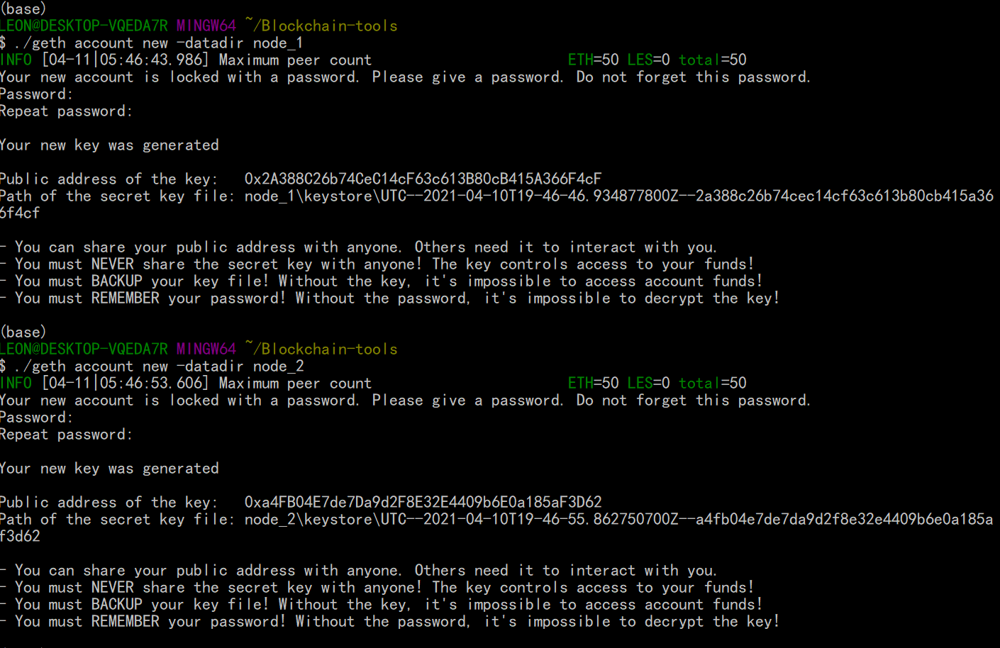
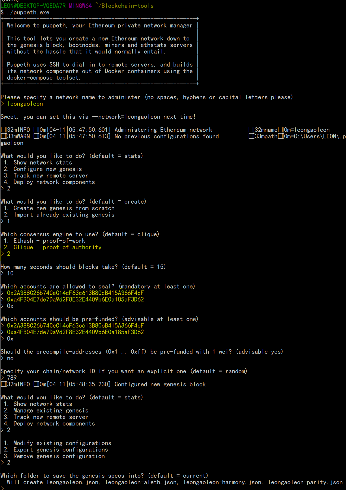
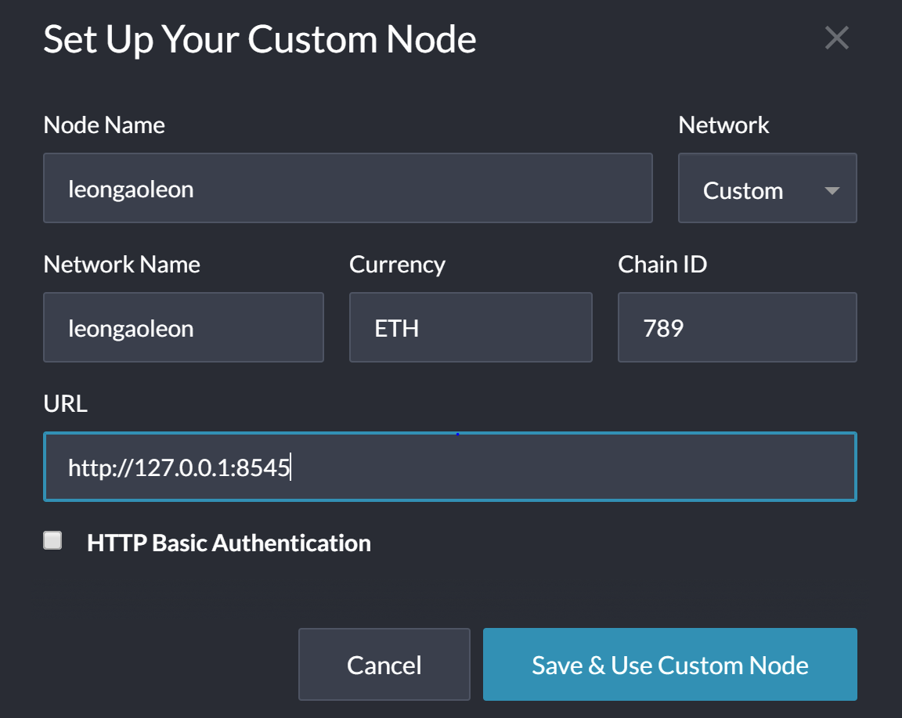
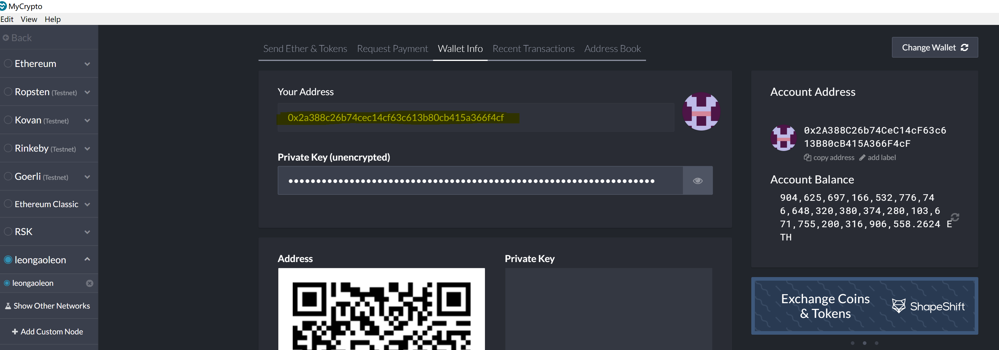
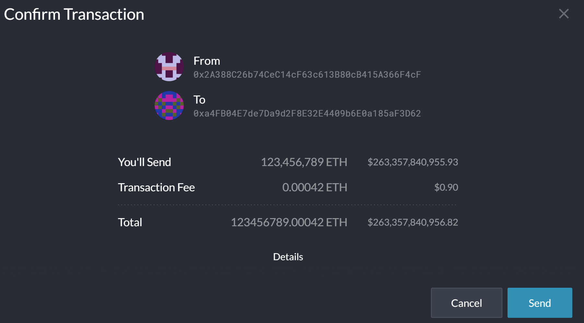
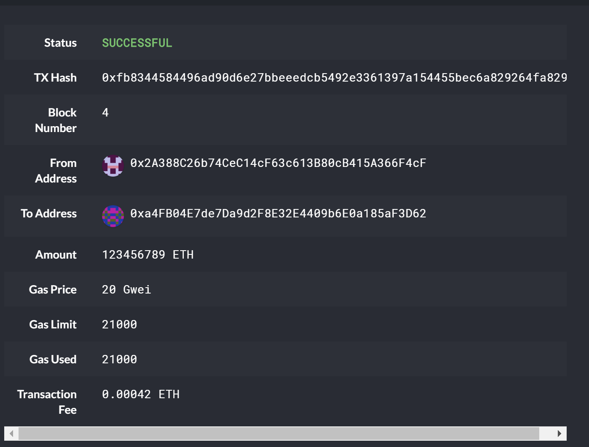

# Unit 18 | Building the Blockchain

The blockchain domain is rapidly changing.  Even those in a highly technical role must stay abreast of what is happening in the digital finance landscape as many FinTech companies are using and creating tools and services that are powered by blockchain. As a FinTech professional in these changing times, it's important to not only be aware of the advancements happening within the FinTech blockchain space, but to also understand the process for developing your very own blockchain.

This homework will be a two-part series in which I will first create a case study on a Canadian FinTech blockchain company. Then, you wil develop your very own blockchain.

## Blockchain Case Study

In this part, [Blockstream](Blockchain_Case_Study/Blockstream.md), a Canadian Bitcoin Blockchain company, has been studied. 

In this research, you will read:

* Background of Blockstream

* Current services and products it provides

* The financial and global impact 

* The concerns as well as criticism around Blockstream sidechain and mining service

## Proof of Authority Development Chain

Step 1: Setting up two nodes:
Addresses of two nodes:
node_1 Address: 0x2A388C26b74CeC14cF63c613B80cB415A366F4cF
node_2 Address: 0xa4FB04E7de7Da9d2F8E32E4409b6E0a185aF3D62

Step 2: Creating genesis block:
A testing network called **leongaoleon** is created, using POA consensus algo. And the block ID is set to 789. 

Step 3: Initializing the nodes:

Step4: Creating custom node (node3):

Step5: Starting the test network:
`./geth --datadir node_1 --unlock "2A388C26b74CeC14cF63c613B80cB415A366F4cF " --mine --rpc --allow-insecure-unlock`

`./geth --datadir node_2 --unlock "a4FB04E7de7Da9d2F8E32E4409b6E0a185aF3D62 " --mine --port 30304 --rpc --bootnodes "enode://4c0d9f7a43d9e2ae30690bbd4aba41e9a9c377b57643593cca2705d11390a67c2bfda21db7db551e788ae7e22db7ce3b28dd871c4fac3840798eaaf3c30e3514@127.0.0.1:30303" --ipcdisable --allow-insecure-unlock --rpc.allow-unprotected-txs`

Then use the keystore file for each node and the **password: 123** to login MyCrypto:

Step6: Sending testing transaction between two nodes:
And you can see the `pending` statu changes to `suscessful` after mining work is done.

